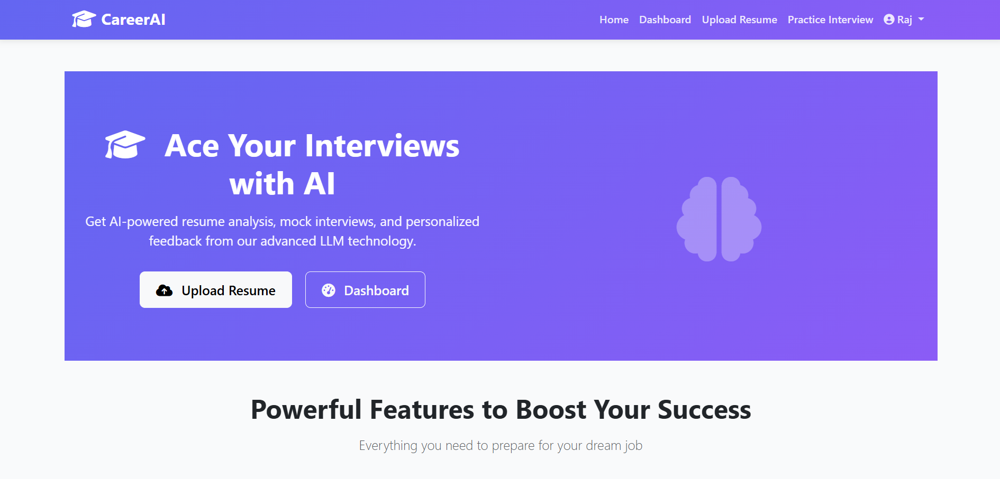
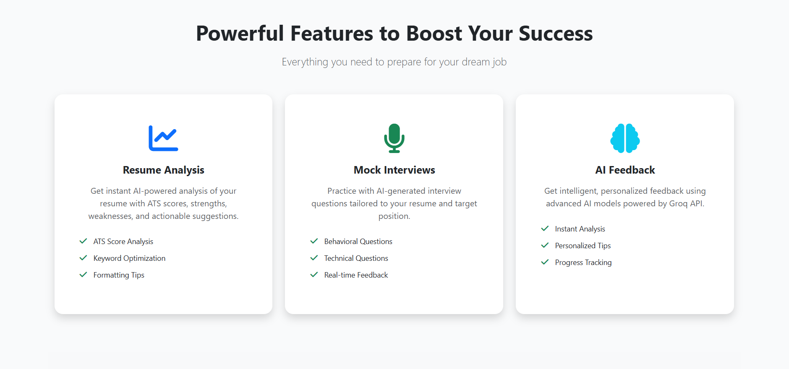
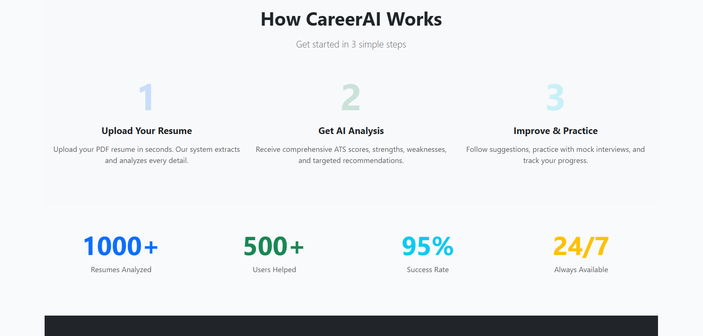
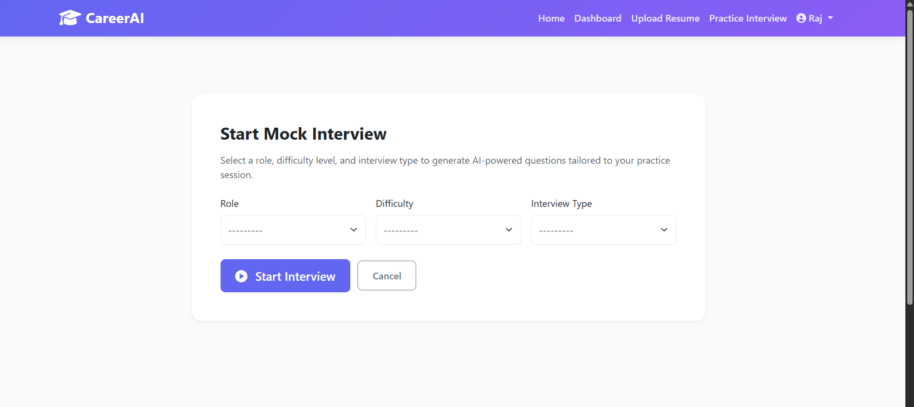

# 🚀 MockMate AI

### AI-Powered Interview Preparation & Resume Intelligence Platform

MockMate AI is a production-ready career acceleration platform that helps students and job seekers improve their resumes, prepare for interviews, and track progress through AI-driven feedback and analytics.

Built using Django, PostgreSQL, and Groq-powered LLMs, MockMate combines ATS resume analysis, mock interviews, and personalized performance insights into a single platform.

🌐 **Live Demo:** https://mockmate-v7if.onrender.com

---

## 📈 Impact

* 👥 100+ Active Users
* 📄 500+ Resume Analyses Processed
* 🤖 1000+ AI Feedback Reports Generated
* ⚡ Resume Evaluation in Under 3 Seconds
* 🌐 Live Production Deployment

---

## 🎯 Problem Statement

Many candidates struggle to understand why their resumes fail ATS screening and often lack structured interview preparation.

MockMate AI solves this by combining resume intelligence, AI-powered mock interviews, and performance analytics to help users prepare more effectively and improve continuously.

---

## ✨ Core Features

### 📄 AI Resume Analyzer

Upload a PDF resume and receive:

* ATS Compatibility Score (0–100)
* Keyword Gap Analysis
* Resume Structure Evaluation
* Formatting Feedback
* Strengths & Weakness Detection
* Actionable Improvement Suggestions

---

### 🤖 AI Mock Interviews

Generate personalized interview experiences with:

* Technical Interview Questions
* HR & Behavioral Questions
* AI-Powered Feedback
* Performance Evaluation
* Context-Aware Recommendations

---

### 📊 Analytics Dashboard

Track and improve performance through:

* Interview History Tracking
* Skill Gap Identification
* Personalized Improvement Roadmaps
* Performance Trend Analysis
* AI-Driven Practice Recommendations

---

### 🔐 User Management

* Secure Authentication System
* User Profiles
* Resume History Storage
* Interview Session Tracking
* Persistent Analytics Data

---

## 🖼️ Screenshots

### Home Page



### Features Overview



### Analytics Dashboard



### Interview Module



---

## 🏗️ System Architecture

```text
User
 │
 ▼
Django Application
 │
 ├── Resume Analysis Engine
 ├── Interview Engine
 ├── Analytics Engine
 └── User Management
 │
 ▼
Groq API (LLaMA 3.3 70B)
 │
 ▼
AI Feedback & Recommendations
 │
 ▼
PostgreSQL Database
```

---

## 🛠️ Tech Stack

### Backend

* Python
* Django 4.2
* Django REST Framework

### AI Layer

* Groq API
* LLaMA 3.3 70B
* Prompt Engineering

### Frontend

* HTML5
* CSS3
* Bootstrap 5
* JavaScript

### Database

* PostgreSQL (Production)
* SQLite (Local Development)

### Additional Tools

* pdfplumber
* Git
* GitHub

---

## 🧠 AI Workflow

```text
Resume Upload
      │
      ▼
PDF Text Extraction
(pdfplumber)
      │
      ▼
Structured Prompt Creation
      │
      ▼
Groq LLM Processing
      │
      ▼
ATS Scoring & Feedback
      │
      ▼
Analytics & Recommendations
```

---

## 🔒 Security Features

* Environment Variable Configuration
* Secure Authentication System
* CSRF Protection
* File Upload Validation
* Structured Error Handling
* Session Security Controls

---

## 🚀 Local Setup

### Clone Repository

```bash
git clone https://github.com/Rajshekhar061/Mockmate.git
cd Mockmate
```

### Create Virtual Environment

```bash
python -m venv venv
```

### Install Dependencies

```bash
pip install -r requirements.txt
```

### Configure Environment Variables

```env
GROQ_API_KEY=your_api_key
SECRET_KEY=your_secret_key
DEBUG=True
```

### Run Migrations

```bash
python manage.py migrate
```

### Start Development Server

```bash
python manage.py runserver
```

---

## 💡 Engineering Challenges Solved

* Built a PDF parsing pipeline for resume ingestion
* Designed ATS scoring and resume evaluation workflows
* Structured prompts for reliable AI-generated feedback
* Developed user analytics and performance tracking systems
* Optimized LLM interactions for faster response times
* Created modular Django architecture for future scalability

---

## 📚 Skills Demonstrated

* Full-Stack Development
* Django Architecture
* REST API Design
* PostgreSQL Database Design
* Authentication & Authorization
* LLM Integration
* Prompt Engineering
* PDF Processing
* Analytics System Design
* Production Deployment

---

## 👨‍💻 Author

**Rajshekhar Singh**

* GitHub: https://github.com/Rajshekhar061
* Portfolio: https://my-portfolio-9wb7.onrender.com
* LinkedIn: https://www.linkedin.com/in/rajshekhar-singh-572574276

---

## ⭐ Support

If you found this project useful:

* ⭐ Star the repository
* 🍴 Fork the project
* 💬 Share feedback

---

## 📜 License

This project is licensed under the MIT License.
